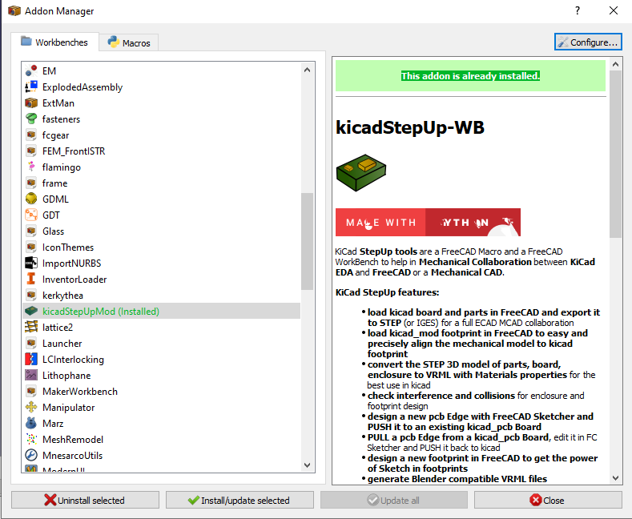
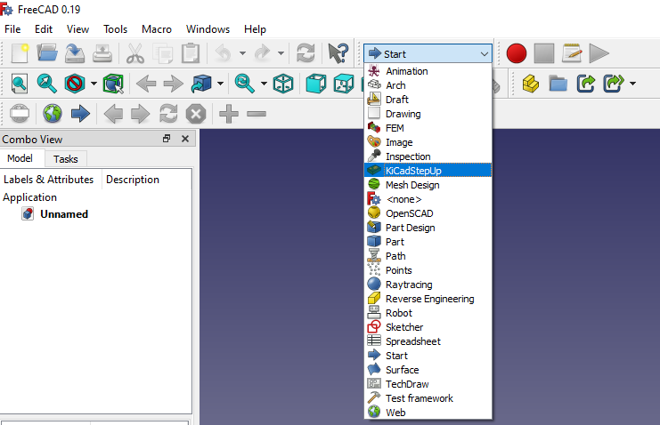
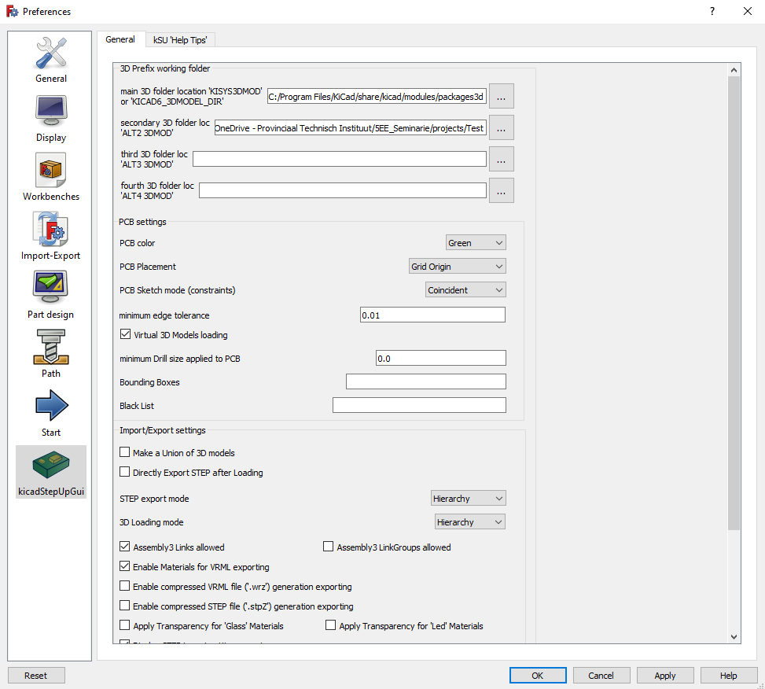
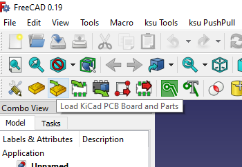
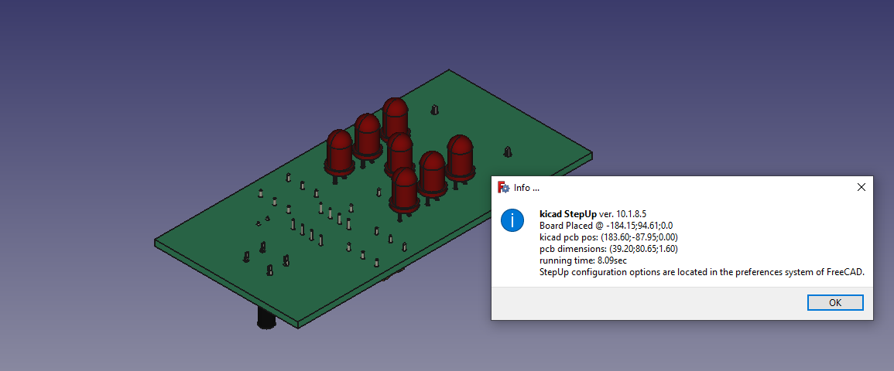

# FreeCAD

Een case op maat kan je via FreeCAD en de KicadStepup addon maken.

## KicadStepUp-WB

Installeer de KicadStepUp-WB, als die nog niet geïnstalleerd is. De addon installeren kan via het menu Tools->Addon Manager.

Kies de KicadStepUp workbench.

Na het selecteren van de KicadStepUp workbench kan er via het menu Edit->preferences de juiste instellingen worden ingesteld. Voeg eventueel extra 3D folder locaties toe. Selecteer bij de PCB placement de Grid Origin optie, zoals weergegeven in de volgende figuur.

## PCB bestand laden

Laad het PCB bestand via het "load Kicad PCB Board and Parts" icon.

Na het inladen van het PCB bestand krijg je een melding over de specificaties en plaatsing van de PCB.

