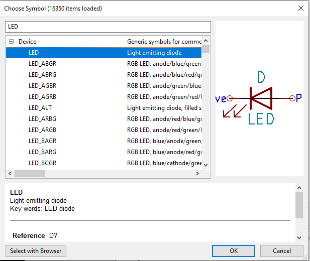

# KiCad

Een dobbelsteen project bestaande uit een Attiny85.

## Dobbelsteen project

Maak een nieuw project aan in KiCad (Ctrl+N).

## Schema

Open de schematic editor (Ctrl+E).

Teken het schema van het dobbelsteen project. Via het place symbol icon (Shift+A) kan je symbolen toevoegen aan je schema.

* Plaats zeven LEDs
* Plaats voor elke LED een weerstand
* Plaats een Attiny85 
* Plaats een drukknop

