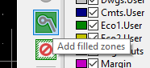

# KiCad

Een dobbelsteen project bestaande uit een Attiny85.

## Dobbelsteen project

Maak een nieuw project aan in KiCad (Ctrl+N).

## Schema

Open de schematic editor (Ctrl+E).

Teken het schema van het dobbelsteen project. 

Via het place symbol icon (Shift+A) kan je symbolen toevoegen aan je schema. Klik met de muis in tekenvlak van de schematic editor om een symbool te kiezen.

### BOM

| Ref | Qnty | Value  |
|:-------------:|:-------------:|:-----:|
|BT1 | 1 | Battery_Cell holder 2032 |
|C1	| 1 | 100nF |
|D1, D2, D3, D4, D5, D6, D7	| 7	| LED |
|R1, R2, R3, R4, R5, R6, R7	| 7 | 180R |
|SW1 | 1 |	SW_Push_Dual_x2	|
|U1	| 1	| ATtiny85V-10PU DIP-8|

### Handige shortcuts zijn

Voor onderstaande shortcuts moet de muiscursor boven het symbool staan.

* c : kopieer symbool
* v : value symbool toevoegen
* m : symbool verplaatsen

## Waarde

Voeg voor elke component de juiste waarde toe. Je kan dit doen door met je muiscursor boven een symbool te gaan staan en op v te drukken.

### Reference designator

Elk symbool in een schema moet een naam krijgen. Deze naam wordt de reference designator genoemd. Reference designator maken het veel gemakkelijker om over de verschillende componenten in het schema te praten. Het is een stuk gemakkelijker om R1, R2, Q1 te zeggen dan te verwijzen naar de tweede 1k weerstand van links in de schakeling in de rechterhoek. De reference designator is ook handig voor het koppelen van het schema naar de layout en vice versa en kan ook als tekst naast de component footprint op de silkscreen geplaatst worden. Zie de [Wikipedia Reference designator](https://en.wikipedia.org/wiki/Reference_designator) voor een lijst van veelgebruikte aanduidingen. 

KiCad maakt automatisch de reference designator aan via de annotate schematic functie.

# Footprints

Voeg voor elk symbool een footprint toe.

## Demonstratie footprints toekennen

## Nieuwe footprint

Voor de batterijhouder moet er een nieuwe footprint gemaakt worden. Doe dit via de footprint editor.

## Overzicht footprint

# Layout

Open de layout editor Pcbnew.

Importeer de componenten van het schema in de layout via Update PCB from schematic.

Plaats de componenten zodanig dat er zo min mogelijk ratsnets kruisen. Verander desnoods de aansluitingen naar de Attiny85.

## Tracks

Teken de PCB tracks (traces) met een geschikte trace breedte.

Tekenen alle pcb banen behalve GND met het Route Tracks commando (Shift+X).

## Edge cut

Teken een board outline op de edge cuts layer met de Add graphics line tool.

Teken een grondvlak op de F.Cu layer met de Add filled zones tool. Teken het grondvlak net iets groter dan de board outline.

Gebruik de instellingen weergegeven op de volgende figuur.

## Resultaat

::: warning
Om de pcb te kunnen importeren in FreeCAD en terug te kunnen exporten moet er een grid origin worden geplaatst in de board outline.

:::

# 3D viewer

Controleer de layout in de 3D viewer van Pcbnew.

Voeg een dip socket toe aan de 3D weergave van de Attiny85. Open hiervoor de properties van de Attiny85 component. Ga naar de 3D Settings en voeg een 8 pin socket toe uit de ${KISYS3DMOD}/Package_DIP.3dshapes/DIP-8_W7.62mm_Socket.step folder.

Verplaats de dip-8 verpakking, zodat de verpakking zich in de socket bevindt.

## 3D weergave

